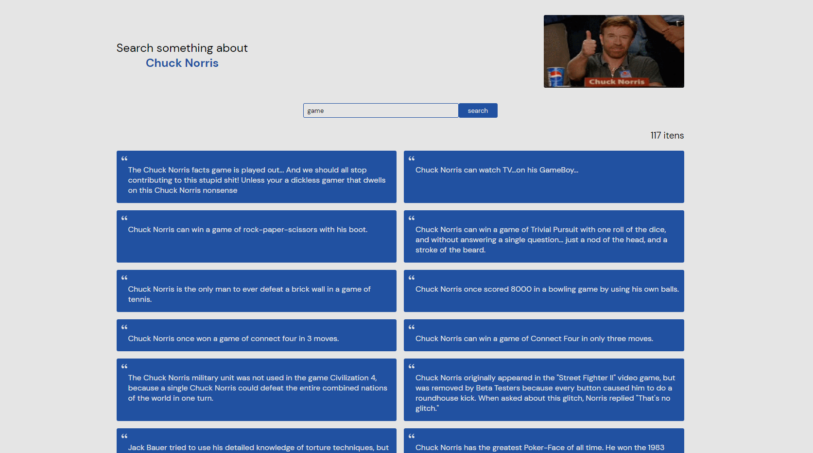

# Getting Started with Create React App

This project was bootstrapped with [Create React App](https://github.com/facebook/create-react-app).

## Chuck Norris API

Integration with chucknorris.io api [https://api.chucknorris.io/](https://api.chucknorris.io/).

### `URL Application`
[chuck-norris-eight.vercel.app](https://chuck-norris-eight.vercel.app)

## Available Scripts

In the project directory, you can run:

### `npm install`
Install all dependencies of project

### `npm start`

Runs the app in the development mode.\
Open [http://localhost:3000](http://localhost:3000) to view it in the browser.

The page will reload if you make edits.\
You will also see any lint errors in the console.

### `npm test`

Nexted press 'a'
Launches the test runner in the interactive watch mode.\
See the section about [running tests](https://facebook.github.io/create-react-app/docs/running-tests) for more information.

### `Home Page`

